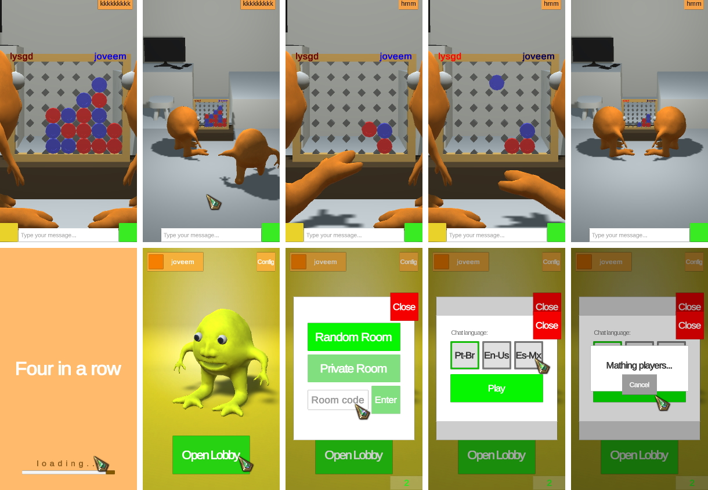
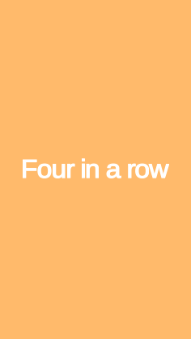
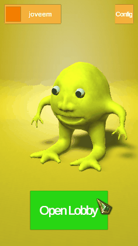

# Four in a row



A virtual version of the board game Four In A Rou (Connect Four, Four Up, Plot Four, Find Four, Four in a Line, Drop Four, and Gravitrips)

The game (you lost) is not just an experience of playing the game but of playing the board game with a person by your side and talking about (or not) the game while you both play

Its Front-End is made in [Unity 3D](https://unity.com/) with C#, its Back-End is made in NodeJS with [Socket.IO](https://socket.io/) for real-time multiplayer and a MongoDB database (its Back-End in [this projetct](https://github.com/joveem/Four-In-A-Row-Back-End))



---

### Getting Started:

##### Cloning the repository:

``` 
git clone https://github.com/joveem/Four-In-A-Row.git
cd Four-In-A-Row
#
```
